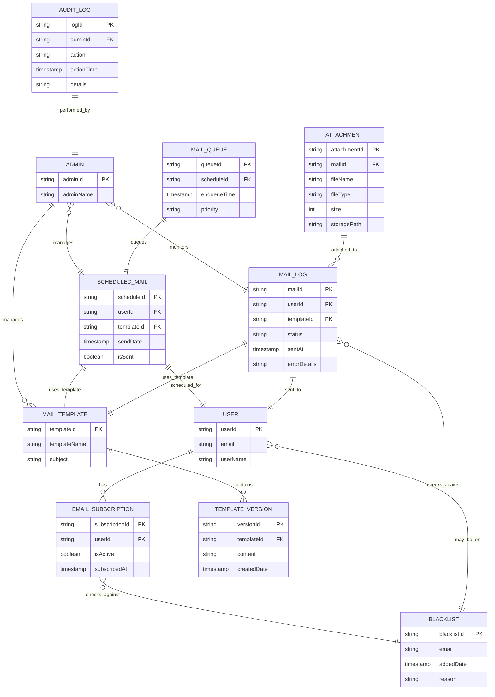

# Mail Service Architecture

## Component Description

### Admin Actions
- Admins can create, edit, or delete email templates
- Templates are stored in object storage (e.g., AWS S3)

### Mail Service
- **Template Retrieval**: Templates are fetched with caching to reduce storage load
- **Email Preparation**: Templates are customized with user data
- **Queue Management**: Emails are queued for efficient bulk operations
- **Sending**: Handles concurrent email dispatch
- **Delivery Verification**: Performs post-send delivery confirmation

### Scheduling and Subscription
- **Mail Scheduling**: Supports delayed email sending
- **Subscription Management**: Handles mailing list updates

### Error Handling
- Implements retry mechanism for failed sends
- Logs errors for troubleshooting
- Notifies administrators of critical issues

## Entity Relationship Diagram

## Entity Relationships Explained

### Core Components
- **User and Subscription**: Users can have multiple email subscriptions for different mailing lists or types of communications
- **Mail Templates and Versions**: Templates can have multiple versions to track changes over time, allowing for rollback or historical reference
- **Mail Logs**: Logs of sent emails, including status and any errors, linked to users and templates

### Email Management
- **Scheduled Mail**: For emails that need to be sent at a later date, with tracking of whether they've been sent
- **Mail Queue**: To manage the sending of scheduled emails, possibly with priority levels for urgent communications
- **Attachments**: Some emails might have attachments, which are stored separately but linked to specific mail logs

### Security and Administration
- **Blacklist**: To prevent sending emails to addresses that have opted out or have been marked as problematic
- **Admin**: Manages templates, can monitor mail logs, and manage scheduled emails
- **Audit Log**: Keeps track of administrative actions for accountability and security
